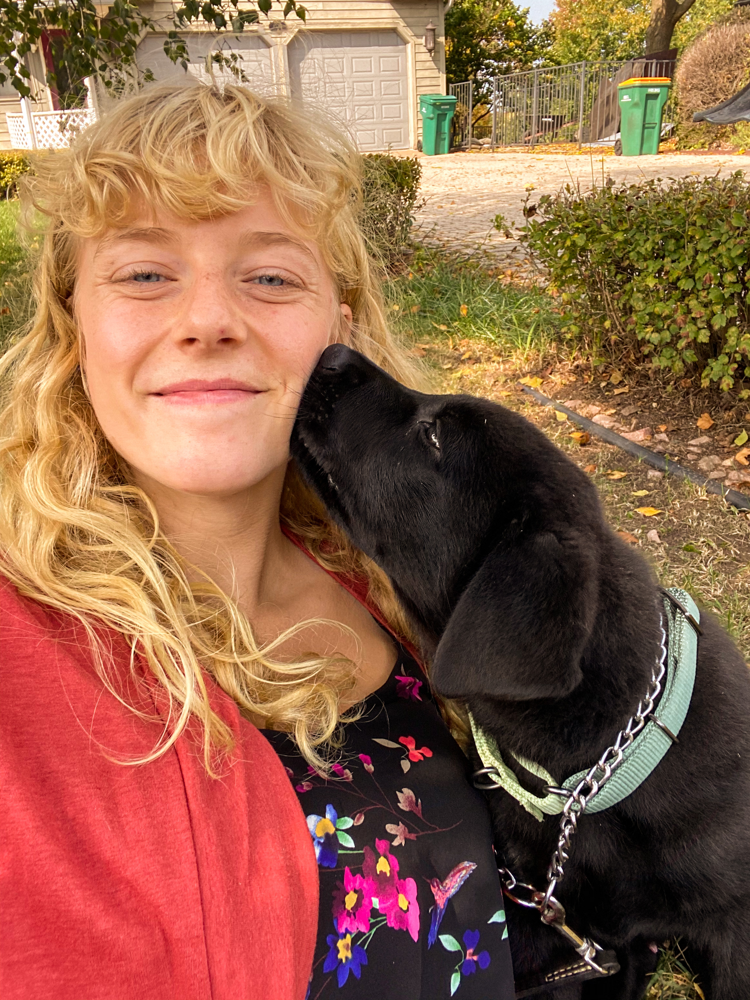

<!DOCTYPE>
<html>

  <head>
    <meta charset="utf-8">
    <title>Meg's Static Site</title>
    <meta name="description" content="Meg's Static Site">
    <link rel="stylesheet" type="text/css" href="style.css">
  </head>

  <body>

      <header>
        <h1>Meg Schulte</h1>
      </header>

      

          

              <ul id= horizontal-list>
                  <li class="menu-item"><a href="projects.html">Home</a></li>
                  <li class="menu-item"><a href="CV.html">Projects</a></li>
                  <li class="menu-item"><a href="CV.html">About</a></li>
                  <li class="menu-item"><a href="CV.html">Contact</a></li>
              </ul>
          

      

      <main class="content">
        <article>
          <h2>Welcome to Meg's personal website.</h2>
          
Enjoy these pictures of Meg and her puppy Oliver.

          
          
        </article>
        <aside>
          
Have comments? Please share via Canvas.

        </aside>
      </main>

      <footer>
        Meg Schulte Static Site WRIT4662, 2020.
      </footer>

  </body>

</html>
